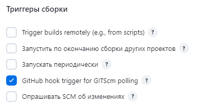

# Lab4. Jenkins

## Введение

Запускаем `docker-compose.yaml`:
```bash
   docker-compose up
```

## Freestyle Job

*Замечание:* Приведенные инструкции работают для проекта на maven. Перед созданием джобы надо убедиться, что версия Java в проекте и в Jenkins совпадает. Версию Java в Jenkins можно посмотреть в "Системная информация" в меню настроек Jenkins.

0. Заливаем проект на публичный (для простоты) репозиторий
1. **Настройка запуска Jenkins по событиям push/pull_request**
   1. Устанавливаем на локальный компьютер утилиту [`ngrok`](https://dashboard.ngrok.com/get-started/setup/windows).
   2. Теперь нам надо получить маршрутизируемый в интернет адрес для Jenkins, на который GitHub будет отсылать сообщение о каких-то событиях. Для этого исполняем в терминале следующую команду:
      ```bash
         .\ngrok http http://localhost:8080
      ```
      *Замечание 1:* С Windows надо запускать именно из папки, в которую распаковали исходники, или добавить ngrok в переменные пути
      
      *Замечание 2:* Так как Jenkins запущен на localhost:8080, то именно этот адрес и указываем в команде
      
      
      
      Полученный адрес копируем
   3. Переходим в GitHub. Заходим в репозиторий с проектом, открываем `Settings`->`Webhooks`. Нажимаем `Add webhook`. Здесь в поле `Payload URL` вставляем полученную ссылку. В поле `Which events would you like to trigger this webhook?` выбираем `Let me select individual events.` и в выпадающем списке выбираем `Pull requests` и `Pushes`. Нажимаем `Add webhook`.
      
      
   4. Теперь надо сконфигурировать Jenkins, чтобы он ожидал триггеров от GitHub. Создаем freestyle job и в секции `Общие настройки` отмечаем чекбокс `GitHub project`. В поле вставляем https url на нашу репу
      
      
      
      В секции `Триггеры сборки` выбираем чекбокс `GitHub hook trigger for GITScm polling`
      
      
2. **Добавление репозитория с проектом**
   1. В секции `Управление исходным кодом` выбираем `Git`. В поле вводим https url на репозиторий. Также в поле `Branches to build` указываем нужную ветку
      
3. **Сборка проекта и запуск автотестов**
   1. Конфигурируем maven: Заходим в `Настройки Jenkins` -> `Tools`, пролистываем до `Установки maven` и выбираем необходимые настройки
      
      
   2. Добавляем шаги сборки. Я добавил compile и test для maven
      
      
   
   *Замечание 1:* Если pom.xml лежит не в корне репозитория, то надо также указать путь до него в каждой стадии сборки в `Расширенные`
   
   *Замечание 2:* Я также добавил вывод результатов тестов в меню `Status` джобы. Для этого в секции `Послесборочные операции` я выбрал пункт `Publish JUnit test result report`, в пути до файла с отчетами указал стандартную директорию для JUnit-тестов: `<путь до корня проекта>/target/surefire-reports/*.xml`
   
   
4. **Сборка результатов тестов в Allure**
   1. Сначала надо скачать плагин Allure для Jenkins. Инструкция по настройке [тут](https://allurereport.org/docs/integrations-jenkins/#_1-install-the-plugin). После установки плагина в секции `Послесборочные операции` появится возможность выбрать `Allure Report`. В поле `Path` указываем путь до директории, в которую Allure должен поместить результаты тестов
      
      
   2. После успешной сборки проекта на главной странице джобы появится кнопка с эмблемой Allure. При переходе по ссылке попадем на страницу с отчетом
      
      
5. **Анализ исходного кода в SonarQube**
   1. Так как SonarQube сам не делаем ничего для получения coverage, то прежде чем конфигурировать Sonar, надо настроить coverage tool. Для Java стандартом является jacoco. Про конфигурацию написано [здесь](https://dev.to/amalja0/how-to-sonarqube-code-coverage-in-jenkins-with-maven-project-3bb6). Надо добавить этот плагин в pom.xml.
   2. Теперь мы можем сконфигурировать сам SonarQube. Начнем с добавления плагина для Jenkins. Далее его надо настроить стандартным образом. Заходим в `Настройки Jenkins` -> `Tools`, пролистываем до `Установки SonarQube Scanner`
      
      
   3. Заходим в интерфейс Sonar (`localhost:9000`), `My Account` -> `Security`. В секции `Generate Tokens` генерируем токен и копируем его.
      
      
   4. Теперь в настройках джоба в секции `Среда сборки` отмечаем чекбокс `Prepare SonarQube Scanner environment`. Нажимаем `Add` -> `Jenkins`. В разделе `Kind` выбираем `Secret text` и вставляем сгенерированный токен. Нажимаем `Add`
   5. Добавляем в секции `Шаги сборки` еще одну стадию сборки для maven и пишем туда в качестве цели `clean install $SONAR_MAVEN_GOAL`
     
      
   
   Теперь после сборки проекта будет отображаться иконка Sonar, а в интерфейсе Sonar можно посмотреть Code Coverage
   
   

   Ссылки по настройке SonarQube: [раз](https://docs.sonarsource.com/sonarqube-server/8.9/analyzing-source-code/scanners/sonarscanner-for-jenkins/) и [два](https://www.geeksforgeeks.org/how-to-integrate-sonarqube-with-jenkins/)
6. **Сборка контейнера**
   1. Настраиваем контейнер для Docker URI: [смотри здесь](https://hub.docker.com/r/alpine/socat/). После создания контейнера надо ввести `docker inspect <container_id> | grep IPAddress`
   2. Создаем Cloud: переходим в `Настройки Jenkins` -> `Clouds`. Нажимаем `New cloud`. Даем имя и вводим `Docker URI` в виде `tcp://<container_ip>:2375`. Сохраняем.

      
   3. В секции `Шаги сборки` добавляем еще один шаг `Build / Publish Docker Image`. Указываем путь до Dockerfile и созданный ранее Cloud

      

Результат:

