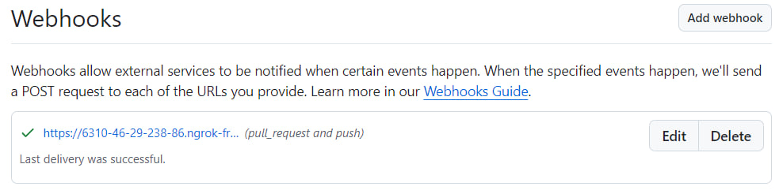

# Lab4. Jenkins

## Содержание:

1. Freestyle Job
   * Настройка запуска Jenkins по событиям с GitHub

## Введение

Запускаем `docker-compose.yaml`:
```bash
   docker-compose up
```

## Freestyle Job

*Замечание:* Приведенные инструкции работают для проекта на maven. Перед созданием джобы надо убедиться, что версия Java в проекте и в Jenkins совпадает. Версию Java в Jenkins можно посмотреть в  "Системная информация" в меню настроек Jenkins.

0. Заливаем проект на публичный (для простоты) репозиторий
1. **Настройка запуска Jenkins по событиям push/pull_request**
   1. Устанавливаем на локальный компьютер утилиту [`ngrok`](https://dashboard.ngrok.com/get-started/setup/windows).
   2. Теперь нам надо получить маршрутизируемый в интернет адрес для Jenkins, на который GitHub будет отсылать сообщение о каких-то событиях. Для этого исполняем в терминале следующую команду:
      ```bash
         .\ngrok http http://localhost:8080
      ```
      *Замечание 1:* С Windows надо запускать именно из папки, в которую распаковали исходники, или добавить ngrok в переменные пути
      
      *Замечание 2:* Так как Jenkins запущен на localhost:8080, то именно этот адрес и указываем в команде
      
      
      
      Полученный адрес копируем
   3. Переходим в GitHub. Заходим в репозиторий с проектом, открываем `Settings`->`Webhooks`. Нажимаем `Add webhook`. Здесь в поле `Payload URL` вставляем полученную ссылку. В поле `Which events would you like to trigger this webhook?` выбираем `Let me select individual events.` и в выпадающем списке выбираем `Pull requests` и `Pushes`. Нажимаем `Add webhook`.
      
   4. Теперь надо сконфигурировать Jenkins, чтобы он ожидал триггеров от GitHub. Создаем freestyle job и в `Общие настройки` отмечаем чекбокс `GitHub project`. В поле вставляем https url на нашу репу
      
2. **Добавление репозитория с проектом**
   1. 